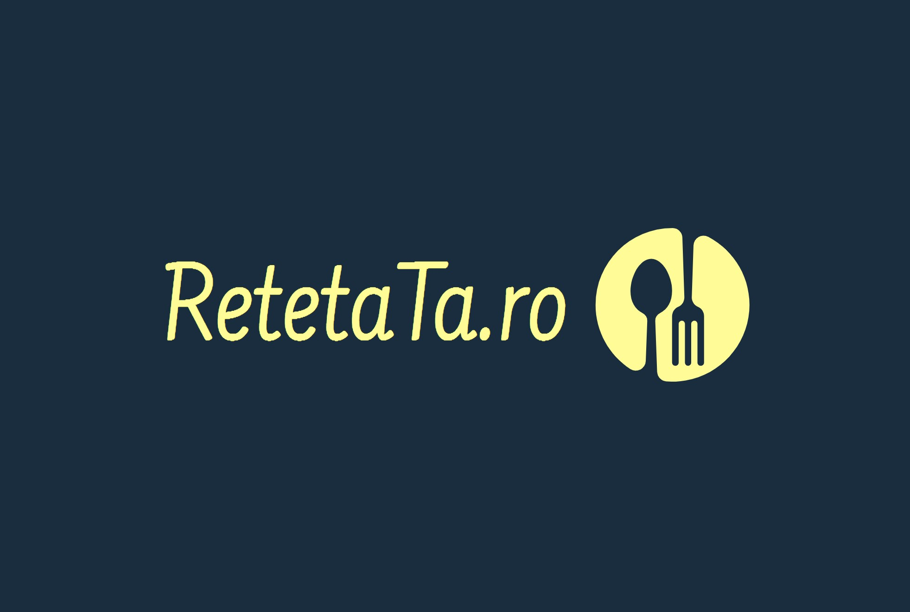

<!-- Improved compatibility of back to top link: See: https://github.com/othneildrew/Best-README-Template/pull/73 -->

<a name="readme-top"></a>

<!--
*** Thanks for checking out the Best-README-Template. If you have a suggestion
*** that would make this better, please fork the repo and create a pull request
*** or simply open an issue with the tag "enhancement".
*** Don't forget to give the project a star!
*** Thanks again! Now go create something AMAZING! :D
-->

<!-- PROJECT SHIELDS -->
<!--
*** I'm using markdown "reference style" links for readability.
*** Reference links are enclosed in brackets [ ] instead of parentheses ( ).
*** See the bottom of this document for the declaration of the reference variables
*** for contributors-url, forks-url, etc. This is an optional, concise syntax you may use.
*** https://www.markdownguide.org/basic-syntax/#reference-style-links
-->

[![Contributors][contributors-shield]][contributors-url]
[![LinkedIn][linkedin-shield]][linkedin-url]

<!-- PROJECT LOGO -->
<br />
<div align="center">
  <a href="https://github.com/Andreid27">
    
  </a>

  <h3 align="center">RetetaTa.ro</h3>

<!-- TABLE OF CONTENTS -->
<details>
  <summary>Conținut</summary>
  <ol>
    <li>
      <a href="#about-the-project">Despre proiect</a>
      <ul>
        <li><a href="#built-with">Tehnologiile folosite</a></li>
      </ul>
    </li>
    <li>
      <a href="#getting-started">Pornirea Aplicatiei</a>
      <ul>
        <li><a href="#prerequisites">Programe Folosite</a></li>
        <li><a href="#installation">Intalare dependinte</a></li>
      </ul>
    </li>
    <li><a href="#usage">Folosință</a></li>
    <li><a href="#roadmap">Roadmap</a></li>
    <li><a href="#contact">Contact</a></li>
  </ol>
</details>

<!-- ABOUT THE PROJECT -->

## About The Project

[![Product Name Screen Shot][product-screenshot]](https://example.com)

Bine ai venit la aplicația noastră de rețete! Înțelegem că, ca o persoană ocupată, nu întotdeauna ai timp să te ocupi de sarcini plictisitoare. De aceea, am proiectat această aplicație cu scopul de a fi singura ta aplicație de rețete de care vei avea nevoie. Cu ajutorul aplicației noastre, poți să te concentrezi pe crearea ceva minunat. Acesta este un proiect care rezolvă o problemă și ajută pe alții.

Aplicația noastră este în continuă evoluție și îmbunătățire, iar sugestiile pentru schimbări sunt binevenite. Poți să ne trimiți sugestiile tale prin a face un fork al repo-ului nostru și prin a crea o cerere de extragere sau prin a deschide o problemă. Poftă bună la gătit!

<p align="right">(<a href="#readme-top">Înapoi</a>)</p>

### Tenologiile folosite

Această secțiune ar trebui să enumere toate frameworks/libraries folosite pentru acest proiect.

- [![Next][next.js]][next-url]
- [![React][react.js]][react-url]
- [![Material-ui][mui]][mui-url]
- [![Fuse][fuse]][fuse-url]
- [![Bootstrap][bootstrap.com]][bootstrap-url]
- [![MySQL][mysql]][mysql-url]

<p align="right">(<a href="#readme-top">back to top</a>)</p>

<!-- GETTING STARTED -->

## Cum începem

Acesta este un exemplu despre cum puteți oferi instrucțiuni despre configurarea proiectului local.
Pentru a obține o copie locală, urmați acești pași simpli de exemplu.

### Prerequisites

This is an example of how to list things you need to use the software and how to install them.

- npm
  ```sh
  npm install npm@latest -g
  ```

### Installation

_Below is an example of how you can instruct your audience on installing and setting up your app. This template doesn't rely on any external dependencies or services._

1. Get a free API Key at [https://example.com](https://example.com)
2. Clone the repo
   ```sh
   git clone https://github.com/your_username_/Project-Name.git
   ```
3. Install NPM packages
   ```sh
   npm install
   ```
4. Install NPM packages

```sh
npm install
```

5. Enter your API in `.env.development`
   ```js
   const API_KEY = "ENTER YOUR API";
   ```

<p align="right">(<a href="#readme-top">back to top</a>)</p>

<!-- USAGE EXAMPLES -->

## Utilitate

Aplicația noastră de rețete este foarte utilă pentru că îți oferă acces la o colecție vastă de rețete delicioase și variate. Indiferent dacă ești începător în arta gătitului sau un bucătar experimentat, vei găsi rețete potrivite pentru tine. Aplicația noastră îți permite să cauți rețete după ingrediente, calorii, cost și alte criterii, astfel încât să poți găsi exact ce cauți. De asemenea, poți salva rețetele favorite pentru a le accesa mai ușor data viitoare când vrei să gătești același fel de mâncare. În plus, aplicația noastră conține sfaturi și trucuri utile pentru a te ajuta să devii un bucătar mai bun. Înțelegem că timpul tău este prețios, așa că am făcut tot posibilul să facem aplicația noastră cât mai ușor de utilizat și să oferim o experiență de gătit cât mai plăcută.

<p align="right">(<a href="#readme-top">back to top</a>)</p>

<!-- ROADMAP -->

## De adăugat

- [x] Logo personalizat
- [ ] Adăugați șabloane suplimentare cu exemple
- [ ] Adăugați documentul „componente” pentru a copia și a lipi cu ușurință secțiunile cititorului
- [ ] Suport în mai multe limbi
  - [ ] Chinez
  - [ ] Spaniolă

<p align="right">(<a href="#readme-top">back to top</a>)</p>

<!-- CONTRIBUTING -->

## Contribuția ta

Contribuțiile fac din comunitatea open source un loc atât de uimitor pentru a învăța, a inspira și a crea. Orice contribuții pe care le faci sunt **foarte apreciate**.

Dacă aveți o sugestie care ar îmbunătăți acest lucru, vă rugăm să bifurcați repo-ul și să creați o cerere de extragere. De asemenea, puteți deschide pur și simplu o problemă cu eticheta „îmbunătățire”.
Nu uitați să acordați o stea proiectului! Multumesc din nou!

1. Bifurcați proiectul
2. Creați-vă ramura de caracteristici (`git checkout -b feature/AmazingFeature`)
3. Commiteți modificările dvs. (`git commit -m 'Adăugați unele caracteristici uimitoare'`)
4. Apăsați la sucursală (`git push origin feature/AmazingFeature`)
5. Deschideți o cerere de tragere

<p align="right">(<a href="#readme-top">back to top</a>)</p>

## Contact

Dincă Andrei-Gabriel - @2023 - andrei@dinca.one

Project Link: [https://github.com/Andreid27/RetetaTa.ro](RetetaTa.ro)

<p align="right">(<a href="#readme-top">back to top</a>)</p>

<!-- ACKNOWLEDGMENTS -->

## Acknowledgments

Use this space to list resources you find helpful and would like to give credit to. I've included a few of my favorites to kick things off!

- [GitHub Emoji Cheat Sheet](https://www.webpagefx.com/tools/emoji-cheat-sheet)
- [Malven's Flexbox Cheatsheet](https://flexbox.malven.co/)
- [Malven's Grid Cheatsheet](https://grid.malven.co/)
- [Img Shields](https://shields.io)
- [GitHub Pages](https://pages.github.com)
- [Font Awesome](https://fontawesome.com)
- [React Icons](https://react-icons.github.io/react-icons/search)

<p align="right">(<a href="#readme-top">back to top</a>)</p>

<!-- MARKDOWN LINKS & IMAGES -->
<!-- https://www.markdownguide.org/basic-syntax/#reference-style-links -->

[contributors-shield]: https://img.shields.io/github/contributors/othneildrew/Best-README-Template.svg?style=for-the-badge
[contributors-url]: https://github.com/Andreid27
[forks-shield]: https://img.shields.io/github/forks/othneildrew/Best-README-Template.svg?style=for-the-badge
[forks-url]: https://github.com/othneildrew/Best-README-Template/network/members
[stars-shield]: https://img.shields.io/github/stars/othneildrew/Best-README-Template.svg?style=for-the-badge
[stars-url]: https://github.com/othneildrew/Best-README-Template/stargazers
[issues-shield]: https://img.shields.io/github/issues/othneildrew/Best-README-Template.svg?style=for-the-badge
[issues-url]: https://github.com/othneildrew/Best-README-Template/issues
[license-shield]: https://img.shields.io/github/license/othneildrew/Best-README-Template.svg?style=for-the-badge
[license-url]: https://github.com/othneildrew/Best-README-Template/blob/master/LICENSE.txt
[linkedin-shield]: https://img.shields.io/badge/-LinkedIn-black.svg?style=for-the-badge&logo=linkedin&colorB=555
[linkedin-url]: https://www.linkedin.com/in/dinca-andrei/
[product-screenshot]: ./FrontendNew/Screenshot.jpg
[next.js]: https://img.shields.io/badge/next.js-000000?style=for-the-badge&logo=nextdotjs&logoColor=white
[next-url]: https://nextjs.org/
[react.js]: https://img.shields.io/badge/React-20232A?style=for-the-badge&logo=react&logoColor=61DAFB
[react-url]: https://reactjs.org/
[mui]: https://cdn-images-1.medium.com/max/2050/1*BKssrX-qEmyN6YaRNTvNlw.png
[mui-url]: https://mui.com/
[fuse]: https://fusetheme.com/static/assets/images/fuse.svg
[fuse-url]: https://fusetheme.com/
[bootstrap.com]: https://img.shields.io/badge/Bootstrap-563D7C?style=for-the-badge&logo=bootstrap&logoColor=white
[bootstrap-url]: https://getbootstrap.com
[mysql]: https://png2.cleanpng.com/sh/4ca3f1eaf21540d2e70230d58614d1fe/L0KzQYm3WMA0N5xxgpH0aYP2gLBuTf16e6JxRdV1dYP3dcO0hPF1aZNmi9c2bXHxcbjsjfVvfF54keV9ZX2w9QoaTnmjoF7qqwg25aYkPjYBrr3lw9QyBDKKLUXlRoW3hMhjPWVoTacDLkezRIe4UMgyOWY4S6QDM0e1Q4S7V8IveJ9s/kisspng-mysql-cluster-database-management-system-%E4%B8%93-%E9%A2%98-%E5%92%96-%E5%95%A1-%E4%B8%8E-%E4%BB%A3-%E7%A0%81-5b640d8b54c558.7046108115332837233472.png
[mysql-url]: https://www.mysql.com/
